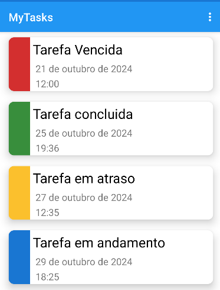

<h1 align="center">Projeto Android - DM125</h1>

### :books: Descrição

<p>Projeto da disciplina DM125 - Desenvolvimento de aplicativos em Kotlin para Android com Firebase </p>
<p>O aplicativo desenvolvido é um gerenciador de tarefas, onde o usuário pode de forma direta realizar a operação de CRUD usando o aplicativo.De forma que ela consiga de forma visual ter um acompanhamento de suas tarefas em andamento, concluídas, atrasadas ou vencidas</p>

#### :hammer_and_wrench: Recursos utilizados na construção
- [Android Studio](https://developer.android.com/studio?hl=pt-br)
- [JDK 17](https://www.oracle.com/java/technologies/downloads/#java17)
- [Firebase](https://firebase.google.com/?hl=pt-br)


### :computer: Funcionalidades do Projeto
<p>Como descrito anteriormente a ideia principal é permitir que o usuário possa criar e gerenciar tarefas de seu cotidiano. A estrutura básica de uma tarefa está composta por: </p>

```
titulo - Título da tarefa
descrição - Breve descrição da tarefa
Data - Data que deseja cumprir a tarefa.
Horário - Horário da tarefa.
```

Dessa forma utilizando da interface do aplicativo ele poderá gerenciar a tarefa, podendo marca-la como concluída e validar de forma visual como está o andamento da tarefa. Existe um código de cores atrelados a todas elas, que funciona com a seguinte regra de negócio:

```
Tarefas sem data ou que ainda estão no prazo: azul
Tarefas vencidas (data anterior a ontem): vermelha
Tarefas que vencem hoje: amarela
Tarefas que foram marcadas como concluída: verde
```



## :gear: Autores
* **Gabriel Ilian Fonseca Barboza** - [Gabriel](https://github.com/G-ilian) 